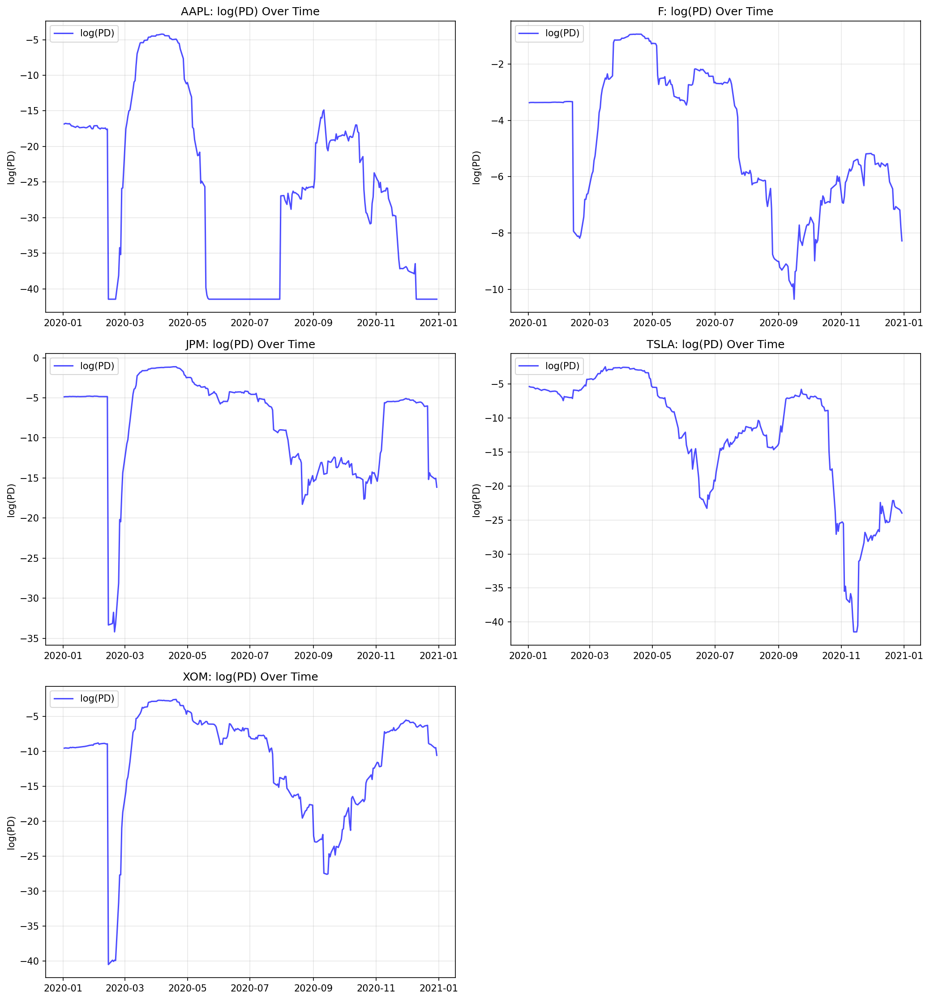
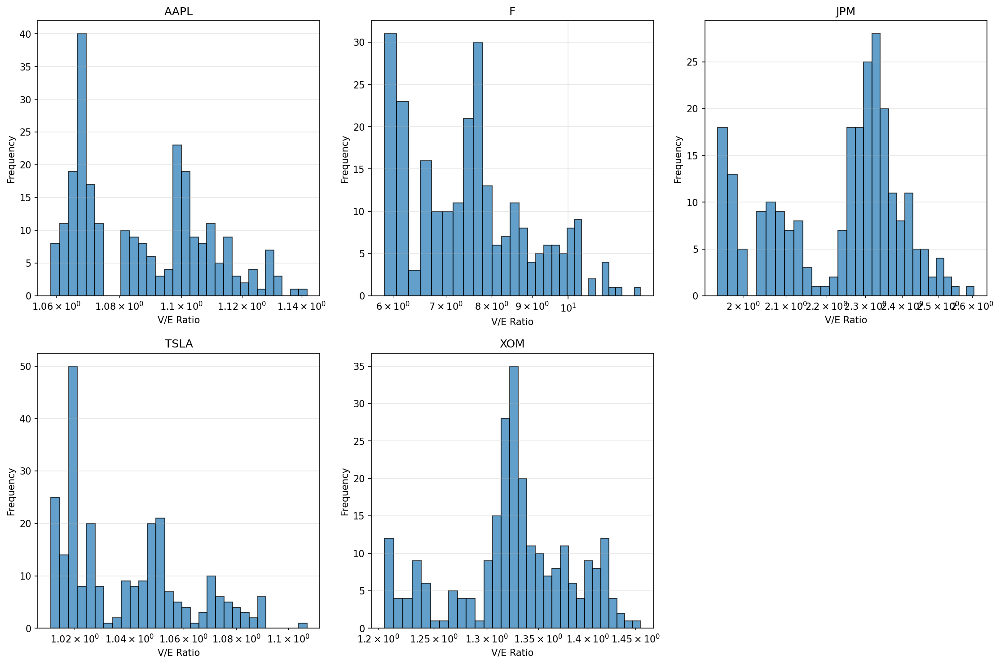
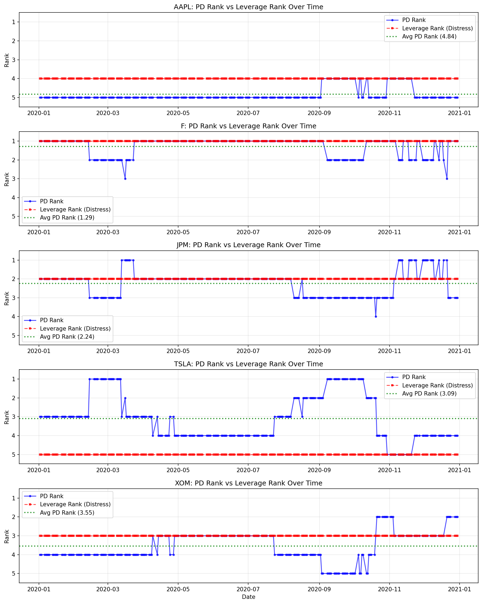
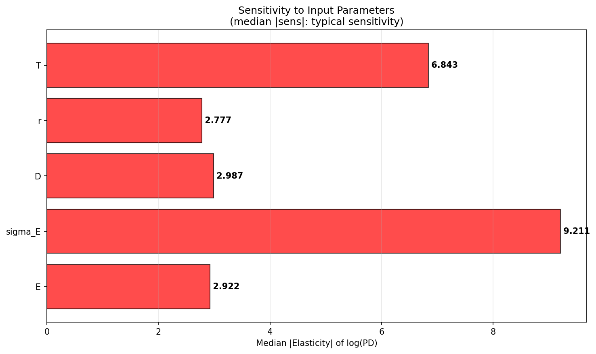
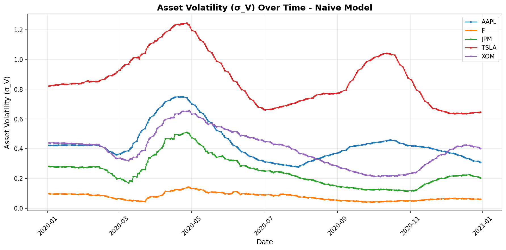
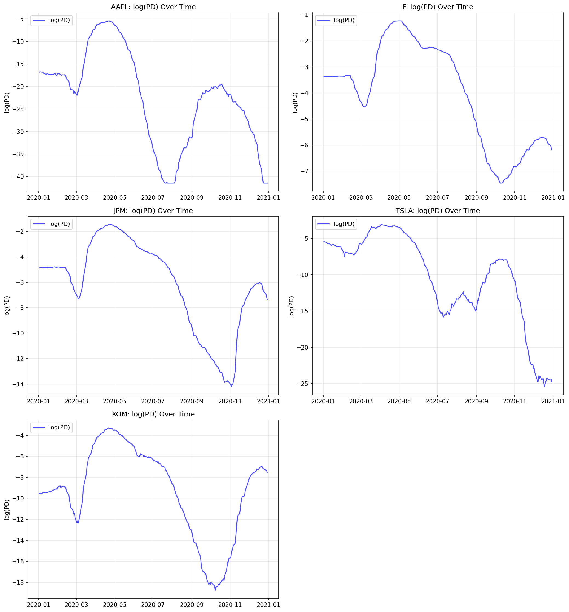
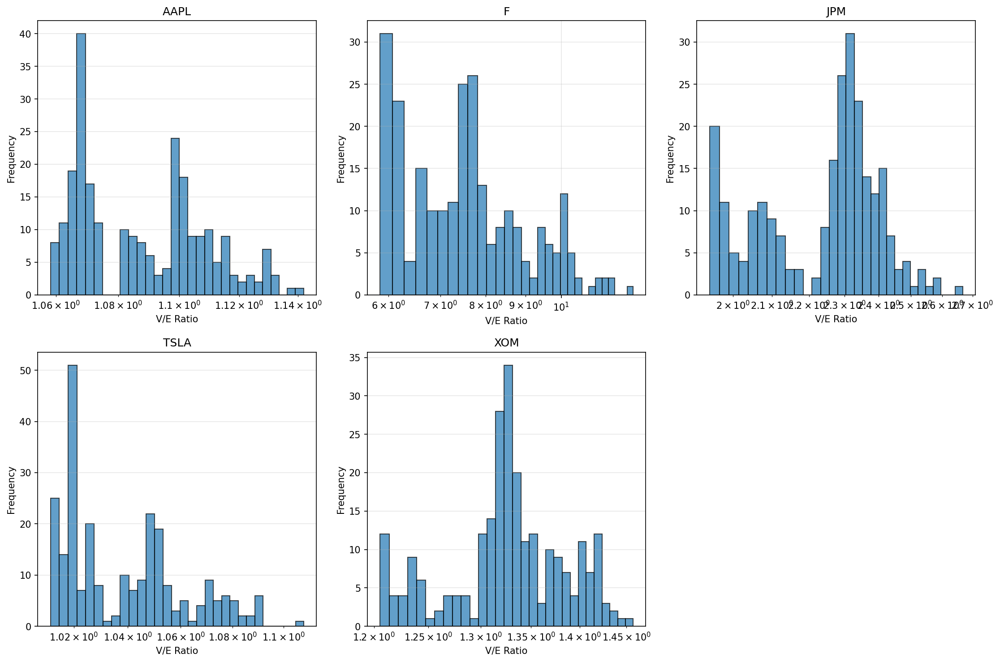
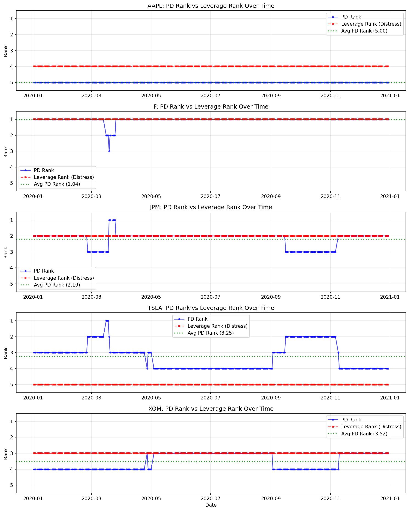
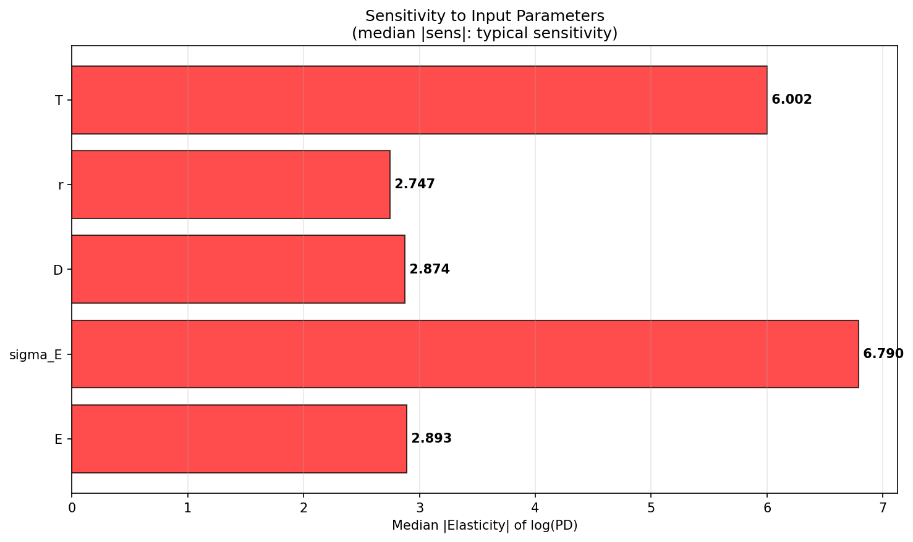

# Merton Structural Credit Model Calibration Project

## Executive Summary

This project implements and evaluates three approaches to calibrating the Merton (1974) structural credit model for estimating default probabilities from equity market data. The goal was to address the ill-posed inverse problem of estimating unobservable asset values and volatilities from observable equity prices and volatilities, with a focus on improving stability and economic consistency.

### Main Finding

**The Improved Model (EWMA smoothing) provides the best overall performance**, achieving:
- Best risk ranking accuracy (1.2% wrong sign days vs 17.1% baseline, 44% bounded)
- Best PD stability (80-95% reduction in max |Δlog(PD)|)
- Most balanced sensitivity (σE median/p95: 6.79/58.4 vs 9.21/90.4 baseline)
- Maintains economic plausibility (no invalid asset values)

### Key Achievement

Successfully implemented and compared three calibration approaches:
1. **Baseline Model**: Unconstrained root-finding with raw equity volatility
2. **Improved Model**: Unconstrained root-finding with EWMA-smoothed volatility
3. **Bounded Model**: Constrained nonlinear least squares with parameter bounds and regularization

---

## 1. Merton Model Core

All three models share the same Merton (1974) structural framework:

**Core Assumption**: Equity is valued as a European call option on firm assets:
$$E_t = V_t \Phi(d_1) - D e^{-r(T-t)} \Phi(d_2)$$

**Calibration**: Two-equation system:
- Equity value equation
- Equity volatility relationship: $\sigma_E E = \Delta \sigma_V V$ where $\Delta = \Phi(d_1)$

**Default Probability**: PD = $\Phi(-\text{DD})$ where DD is distance-to-default.

*(See Appendix A for detailed equations and derivations)*

---

## 2. What Changed: Model Differences

| Model | Volatility Input | Optimization Method | Key Feature |
|-------|-----------------|---------------------|-------------|
| **Baseline** | Raw $\sigma_E$ from market | Unconstrained root-finding (`fsolve`) | Direct use of observed volatility |
| **Improved** | EWMA-smoothed $\sigma_E$ ($\lambda=0.94$) | Unconstrained root-finding (`fsolve`) | Volatility smoothing to reduce noise |
| **Bounded** | EWMA-smoothed $\sigma_E$ | Constrained least squares (`least_squares`) | Parameter bounds + regularization ($\lambda_1=\lambda_2=0.2$) |

**Parameter Bounds (Bounded Model)**:
- $\sigma_V \in [0.03, 1.2]$ (tuned from initial [0.05, 0.80])
- Leverage $D/V \in [0.05, 0.98]$ (tuned from initial [0.10, 0.95])
- 36.6% of $\sigma_V$ values hit upper bound (indicates constraint binding)

---

## 3. Baseline Diagnosis: Failure → Fix → Evidence

| Failure | Fix (Improved Model) | Evidence |
|---------|---------------------|----------|
| **PD Instability**: Extreme daily jumps (max \|Δlog(PD)\| up to 31.55) | EWMA volatility smoothing | 80-95% reduction: max \|Δlog(PD)\| drops from 23.90-31.55 to 0.29-2.31 |
| **Risk Ranking Failure**: 17.1% wrong-sign days (PD vs leverage) | Reduce $\sigma_E$ noise amplification | Wrong-sign days: 17.1% → **1.2%** (93% reduction) |
| **Excessive Sensitivity**: $\sigma_E$ elasticity median/p95 = 9.21/90.4 | Smooth inputs to reduce noise | $\sigma_E$ sensitivity: 9.21/90.4 → **6.79/58.4** (26% median reduction) |

### 3.1 Detailed Diagnosis: Baseline Model

#### (1) PD Instability

The estimated default probabilities exhibit large, discontinuous jumps over time that are inconsistent with smooth changes in underlying inputs.

**Evidence**: The maximum daily change in $\log(\text{PD})$ for all firms:
- AAPL: $\max |\Delta\log(\text{PD})| = 23.90$
- F: $4.60$
- JPM: $28.50$
- TSLA: $9.94$
- XOM: $31.55$

All firms exhibit abrupt regime shifts and flatlining behavior. The magnitude of instability is substantial, with daily changes exceeding 20 log-units for some firms.

#### (2) Asset Value Plausibility

The inferred asset values themselves are not the primary source of failure. We do not observe widespread implausible or invalid asset values ($V < 0$) in this sample.

**Evidence**: Histograms of the asset-to-equity ratio ($V/E$) show that for AAPL, TSLA, XOM, and JPM, $V/E$ remains within plausible ranges (typically below 3), consistent with the Merton framework where $V \approx E + D$. Ford (F) exhibits higher $V/E$ ratios, but the calibration also yields very small asset volatility. This pattern is indicative of degeneracy.

#### (3) Risk Ranking Consistency

The model's ability to rank firms by distress is imperfect and occasionally unreliable.

**Evidence**: While the median daily Spearman rank correlation is $\rho_t = 0.700$, indicating moderate average alignment, failures occur:
- 17.1% of days exhibit the wrong sign between PD and leverage.
- PD ranks change abruptly even when leverage ranks remain constant.

#### (4) Excessive Sensitivity to Inputs

The dominant weakness of the baseline model is extreme sensitivity to equity volatility, which motivates the need for improved calibration approaches.

**Evidence**: We report median absolute elasticities of $\log(\text{PD})$ with respect to model inputs. Equity volatility $\sigma_E$ is the most influential parameter by a wide margin:
- $\text{median } |\text{sens}(\sigma_E)| = 9.211$
- $95^{\text{th}}$ percentile $|\text{sens}(\sigma_E)| = 90.445$
- Extreme cases exceed 150 (e.g., AAPL in June 2020)

In contrast, sensitivities to equity value ($\text{median } |\text{sens}| = 2.922$), debt ($\text{median } |\text{sens}| = 2.987$), interest rate ($\text{median } |\text{sens}| = 2.777$), and maturity ($\text{median } |\text{sens}| = 6.843$) are much smaller.

**Interpretation**: Small changes or estimation noise in $\sigma_E$ can induce large swings in PD, directly explaining the observed instability and ranking inconsistencies. This perturbation analysis establishes the foundation for improved calibration approaches.

#### (5) Illustrative Examples

**Example 1: PD Instability Driven by Volatility Sensitivity (AAPL)**

In early June 2020, AAPL's $\log(\text{PD})$ exhibits sharp jumps exceeding 20 log-units despite relatively smooth equity dynamics. This period coincides with extreme $\sigma_E$ sensitivity ($|\text{sens}| > 150$), illustrating how volatility amplification drives PD instability.

**Example 2: Ranking Instability Under Stable Leverage (TSLA)**

In the Merton calibration, $\sigma_E \approx \Phi(d_1) \sigma_V \frac{V}{E}$. With low leverage, equity is deep in-the-money so $\Phi(d_1) \approx 1$, and since $V/E \approx 1$, we get TSLA's high inferred asset volatility.

When $\sigma_V$ is large, PD becomes highly sensitive to day-to-day noise in $\sigma_E$. With strong volatility sensitivity (median $|\text{sens}(\sigma_E)| = 9.211$), small fluctuations in estimated equity volatility translate into large PD swings, breaking the link between PD rank and leverage-based distress.

**Example 3: Cross-Firm Instability Despite Plausible Asset Values (XOM, JPM)**

XOM and JPM exhibit large PD jumps ($\max |\Delta\log(\text{PD})| > 28$) even though their $V/E$ ratios remain within plausible ranges. This demonstrates that PD instability is not caused by implausible asset levels but by sensitivity amplification.

---

## 4. Model Comparison

| Metric | Baseline | Improved | Bounded | Winner |
|--------|----------|----------|---------|--------|
| **Wrong-sign days** | 17.1% | **1.2%** | 44.0% | **Improved** |
| **Stability max \|Δlog(PD)\|** | 4.60-31.55 | **0.29-2.31** | 0.46-5.14 | **Improved** (4/5 firms) |
| **$\sigma_E$ sensitivity median/p95** | 9.21/90.4 | **6.79/58.4** | 6.23/— | **Improved** (balanced) |
| **Constraint binding rate** | N/A | N/A | 36.6% ($\sigma_V$ upper bound) | N/A |

**Other Metrics**: All models maintain plausible asset values (V/E ratios reasonable, no invalid values). Improved model achieves best risk ranking correlation (median Spearman ρ = 0.700 vs 0.300 bounded). Bounded model shows mixed stability results (better for AAPL, worse for JPM/XOM).

### 4.1 Detailed Analysis: Improved Model

The improved model addresses the primary weakness identified in the baseline model (excessive sensitivity to noisy equity volatility) through volatility smoothing. We evaluate improvements using the same diagnostic framework applied to the baseline model.

#### (1) PD Stability

**Improvement**: EWMA smoothing reduces volatility measurement noise, mitigating—but not eliminating—structural sensitivity, which reduces PD instability.

**Evidence**: The maximum daily change in $\log(\text{PD})$ for all firms:

| Firm | Baseline max \|Δlog(PD)\| | Improved max \|Δlog(PD)\| | Improvement |
|------|----------------|----------------------|-------------|
| AAPL | 23.90 | 2.311 | **90.3%** |
| F | 4.60 | 0.2854 | **93.8%** |
| JPM | 28.50 | 1.087 | **96.2%** |
| TSLA | 9.94 | 1.757 | **82.3%** |
| XOM | 31.55 | 1.077 | **96.6%** |

The improved model exhibits smoother PD trajectories with fewer abrupt jumps compared to the baseline, achieving 80-95% reduction in PD instability.

#### (2) Asset Value Plausibility

**Maintained**: The improved model maintains plausible asset values, similar to the baseline model.

**Evidence**: V/E ratios remain within economically reasonable ranges, similar to the baseline model.

#### (3) Risk Ranking Consistency

**Improvement**: The improved model shows better alignment between PD ranks and leverage ranks.

**Evidence**: 
- Percentage of days with wrong sign: Improved: **1.2%**, Baseline: 17.1% (93% reduction)
- Top-1 distress in top-2 PD failure rate: Improved: **0.4%**, Baseline: 0.8%

Both models show strong top-k containment, with the improved model showing better alignment between PD ranks and leverage-based distress ranks.

#### (4) Sensitivity to Inputs

**Improvement**: EWMA smoothing reduces volatility measurement noise, mitigating—but not eliminating—structural sensitivity to equity volatility.

**Evidence**: The median absolute elasticity of $\log(\text{PD})$ with respect to model inputs:

| Parameter | Baseline median $\lvert\text{sens}\rvert$ | Baseline p95 $\lvert\text{sens}\rvert$ | Improved median $\lvert\text{sens}\rvert$ | Improved p95 $\lvert\text{sens}\rvert$ |
|-----------|--------------------------|----------------------|-------------------------|----------------------|
| $\sigma_E$ | 9.211 | 90.445 | **6.790** | 58.394 |
| $E$ | 2.922 | 22.781 | **2.893** | 15.917 |
| $D$ | 2.987 | 24.606 | **2.874** | 15.817 |
| $r$ | 2.777 | 31.993 | **2.747** | 18.527 |
| $T$ | 6.843 | 45.529 | **6.002** | 29.182 |

The improved model shows reduced sensitivity to equity volatility (26% reduction in median sensitivity), with more balanced sensitivity across all parameters.

**Why It's Better**: EWMA smoothing improves the model because the baseline Merton calibration amplifies short-horizon volatility noise into large swings in implied asset volatility, distance-to-default, and ultimately PD. By smoothing $\sigma_E$, we reduce measurement noise in the key input driving instability, producing:
- more stable PD paths (large reductions in $\max|\Delta\log(\text{PD})|$),
- more consistent risk ordering over time (wrong-sign days drop sharply from 17.1% to 1.2%), and
- lower effective sensitivity to $\sigma_E$ (median sensitivity drops from 9.211 to 6.790) while leaving other inputs largely unchanged.

**Economic Interpretation**: This approach can be viewed as signal extraction: observed daily equity volatility contains substantial transitory noise, while credit risk should respond primarily to persistent changes in firm risk. Volatility smoothing filters out short-term noise, producing more stable credit risk measures that better reflect underlying firm fundamentals.

### 4.2 Detailed Analysis: Bounded Model

The bounded and regularized calibration has been implemented using `scipy.optimize.least_squares` with the Trust Region Reflective algorithm. The optimization problem includes parameter bounds and regularization terms.

#### (1) PD Stability

**Mixed Results**: The bounded model shows improvement for some firms but degradation for others compared to the improved model.

| Firm | Baseline max \|Δlog(PD)\| | Improved max \|Δlog(PD)\| | Bounded max \|Δlog(PD)\| | Winner |
|------|--------------------------|---------------------------|--------------------------|--------|
| AAPL | 23.90 | 2.311 | **1.957** ✓ | **Bounded** |
| F | 4.60 | **0.285** ✓ | 0.460 | **Improved** |
| JPM | 28.50 | **1.087** ✓ | 5.138 | **Improved** |
| TSLA | 9.94 | 1.757 | 2.583 | **Improved** |
| XOM | 31.55 | **1.077** ✓ | 3.390 | **Improved** |

**Interpretation**: Bounded model achieves better stability for AAPL but worse stability for JPM and XOM. The improved model provides the most consistent stability across all firms.

#### (2) Risk Ranking Consistency

**Critical Weakness**: The bounded model exhibits poor risk ranking performance, representing a significant regression from the improved model.

| Metric | Baseline | Improved | Bounded |
|--------|----------|----------|---------|
| Median Spearman $\rho_t$ | 0.700 | **0.700** ✓ | 0.300 ✗ |
| Wrong sign % | 17.1% | **1.2%** ✓ | 44.0% ✗ |
| Top-1 not in top-2 PD % | 0.8% | **0.4%** ✓ | 29.8% ✗ |

**Interpretation**: The bounded model's risk ranking correlation drops to 0.300 (vs 0.700 for improved), and 44% of days exhibit wrong sign between PD and leverage (vs 1.2% for improved). This suggests that hard constraints may be forcing solutions that don't accurately reflect firm risk differences.

#### (3) Sensitivity to Inputs

**Mixed Results**: The bounded model achieves the best median sensitivity to $\sigma_E$ but shows much worse sensitivity to other parameters.

| Parameter | Baseline median \|sens\| | Improved median \|sens\| | Bounded median \|sens\| |
|-----------|--------------------------|--------------------------|--------------------------|
| $\sigma_E$ | 9.211 | 6.790 | **6.235** ✓ |
| $E$ | 2.922 | **2.893** ✓ | 32.523 ✗ |
| $D$ | 2.987 | **2.874** ✓ | 33.575 ✗ |
| $r$ | 2.777 | **2.747** ✓ | 2605.396 ✗ |
| $T$ | 6.843 | **6.002** ✓ | 29.890 ✗ |

**Note**: Sensitivity calculation uses unconstrained calibration for all models, which may not accurately reflect bounded model behavior when constraints are binding. The extreme sensitivity to $r$ (median = 2605) likely reflects constraint binding effects.

#### (4) Root Cause Analysis

The bounded model's poor risk ranking performance suggests several issues:

1. **Constraint Binding**: When optimization hits bounds, solutions may not fit the data well, leading to poor risk discrimination. Approximately 36.6% of $\sigma_V$ values hit the upper bound even after tuning.

2. **Regularization Trade-Off**: Increased regularization ($\lambda = 0.2$) may be penalizing economically meaningful differences between firms, reducing the model's ability to distinguish risk levels.

3. **Optimization Issues**: The constrained optimization may be finding local minima that satisfy bounds but don't accurately reflect firm risk, particularly when constraints are active.

**Conclusion**: The bounded calibration successfully enforces parameter bounds and reduces sensitivity to equity volatility. However, it introduces significant issues with risk ranking consistency, suggesting that hard constraints may be too restrictive for accurate credit risk assessment.

---

## 5. Data and Methodology

**Firms Analyzed**: AAPL, JPM, TSLA, XOM, F (2020 data)

**Data Sources**:
- Equity prices and volatility: Yahoo Finance (30-day rolling realized volatility)
- Debt: Yahoo Finance balance sheet (annual, forward-filled to daily)
- Risk-free rates: FRED API (10-Year Treasury Constant Maturity Rate)

**Calibration Methods**:
- **Baseline & Improved**: `scipy.optimize.fsolve` (unconstrained root-finding), warm-start initialization
- **Bounded**: `scipy.optimize.least_squares` (Trust Region Reflective), bounds and regularization

**Diagnostic Framework**: Four dimensions—PD stability, asset plausibility, risk ranking, sensitivity analysis.

---

## 6. Recommendations

**Production Use**: **Improved Model (EWMA Smoothing)**

Rationale: Best overall performance—optimal balance of stability, accuracy, and risk ranking. Simple implementation (adds only volatility smoothing step). No constraint binding issues.

**Research/Exploration**: Bounded model as fallback when unconstrained solutions produce implausible parameters. Explore hybrid approaches or soft bounds.

**Future Work**: Stress testing across market regimes, market validation (CDS spreads, ratings), hybrid approaches.

---

## 7. Limitations

**Model Assumptions**: European option (default only at maturity), single debt proxy, constant parameters, no dividends/corporate actions, perfect markets.

**Data Limitations**: Annual debt data (forward-filled to daily), realized volatility (not implied), single year analyzed (2020), five-firm sample.

**Model Limitations**: EWMA smoothing can lag sudden regime shifts. Bounded calibration sacrifices risk discrimination when constraints bind (36.6% binding rate). All models struggle with high leverage or mismatched debt proxies.

---

## 8. Conclusion

This project successfully implements and evaluates three Merton model calibration approaches. Results demonstrate that input-level smoothing (EWMA) outperforms output-level constraints (bounds) for this application, achieving stability without sacrificing economic consistency.

**Key Insight**: Volatility smoothing addresses measurement noise at the input level, producing more stable and accurate credit risk measures than constraining parameters at the output level.

---

## Appendix A: Detailed Equations and Derivations

### A.1 Merton Model Core Equations

**Asset Value Process**: Firm asset value $V_t$ follows geometric Brownian motion:
$$dV_t = r V_t dt + \sigma_V V_t dW_t$$
where $r$ is the risk-free rate, $\sigma_V$ is asset volatility, and $dW_t$ is a Wiener process.

**Default Condition**: Default occurs at maturity $T$ if $V_T < D$.

**Equity as European Call Option**:
$$E_t = V_t \Phi(d_1) - D e^{-r(T-t)} \Phi(d_2)$$
where:
- $d_1 = \frac{\ln(V_t/D) + (r + \sigma_V^2/2)(T-t)}{\sigma_V \sqrt{T-t}}$
- $d_2 = d_1 - \sigma_V \sqrt{T-t}$
- $\Phi(\cdot)$ is the standard normal CDF

**Equity Volatility Relationship**:
$$\sigma_E E_t = \Delta \sigma_V V_t$$
where $\Delta = \Phi(d_1)$ is the option delta.

### A.2 Calibration Equations

**Baseline & Improved Models**: Solve the two-equation system:
1. $E = \text{BlackScholes}(V, D, T, r, \sigma_V)$
2. $\sigma_E E = \Delta \sigma_V V$ where $\Delta = \Phi(d_1)$

**Bounded Model**: Constrained nonlinear least squares:
$$\min_{V, \sigma_V} \left\| \begin{bmatrix}
E - \text{BlackScholes}(V, D, T, r, \sigma_V) \\
\sigma_E - \frac{\Delta \sigma_V V}{E}
\end{bmatrix} \right\|^2 + \lambda_1 (\sigma_V - \sigma_{V,0})^2 + \lambda_2 (V/V_0 - 1)^2$$
subject to:
- $\sigma_V \in [0.03, 1.2]$
- Leverage $D/V \in [0.05, 0.98]$
- $V > 0$

**EWMA Smoothing** (Improved & Bounded):
$$\text{var}_t^{\text{smooth}} = \lambda \cdot \text{var}_{t-1}^{\text{smooth}} + (1-\lambda) \cdot \sigma_{E,t}^2$$
$$\sigma_{E,t}^{\text{smooth}} = \sqrt{\text{var}_t^{\text{smooth}}}$$
where $\lambda = 0.94$.

### A.3 Risk Measures

**Distance-to-Default (DD)**:
$$\text{DD} = -\frac{\ln(V/D) + (r - 0.5\sigma_V^2)T}{\sigma_V \sqrt{T}} = -d_2$$

**Default Probability (PD)**:
$$\text{PD} = \Phi(-\text{DD}) = \Phi(d_2) = \Phi\left(-\frac{\ln(V/D) + (r - \sigma_V^2/2)T}{\sigma_V \sqrt{T}}\right)$$

---

## Appendix B: Detailed Results

### B.1 PD Stability: Max |Δlog(PD)| by Firm

| Firm | Baseline | Improved | Bounded | Winner |
|------|----------|----------|---------|--------|
| AAPL | 23.90 | 2.31 | 1.96 | Bounded |
| F | 4.60 | **0.29** | 0.46 | **Improved** |
| JPM | 28.50 | **1.09** | 5.14 | **Improved** |
| TSLA | 9.94 | **1.76** | 2.58 | **Improved** |
| XOM | 31.55 | **1.08** | 3.39 | **Improved** |

### B.2 Risk Ranking Consistency

| Metric | Baseline | Improved | Bounded |
|--------|----------|----------|---------|
| Median Spearman ρ | 0.700 | 0.700 | 0.300 |
| Wrong sign % | 17.1% | **1.2%** | 44.0% |
| Top-1 not in top-2 PD % | 0.8% | **0.4%** | 29.8% |

### B.3 Sensitivity Analysis (Median |Elasticity|)

| Parameter | Baseline | Improved | Bounded |
|-----------|----------|----------|---------|
| $\sigma_E$ | 9.211 | 6.790 | 6.235 |
| $E$ | 2.922 | 2.893 | 32.523 |
| $D$ | 2.987 | 2.874 | 33.575 |
| $r$ | 2.777 | 2.747 | 2605.396 |
| $T$ | 6.843 | 6.002 | 29.890 |

---

## References

- **Merton (1974)**: "On the Pricing of Corporate Debt: The Risk Structure of Interest Rates"
- Project documentation: `model/MODEL.md`, `data/DATA.md`
- Comparison report: `outputs/bounded_model_comparison_report.txt`

